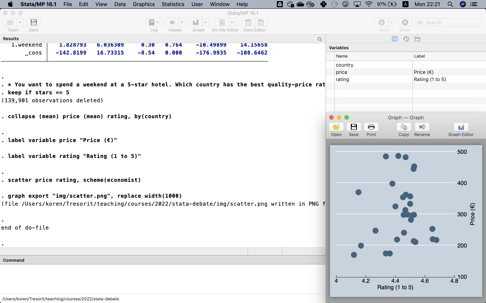
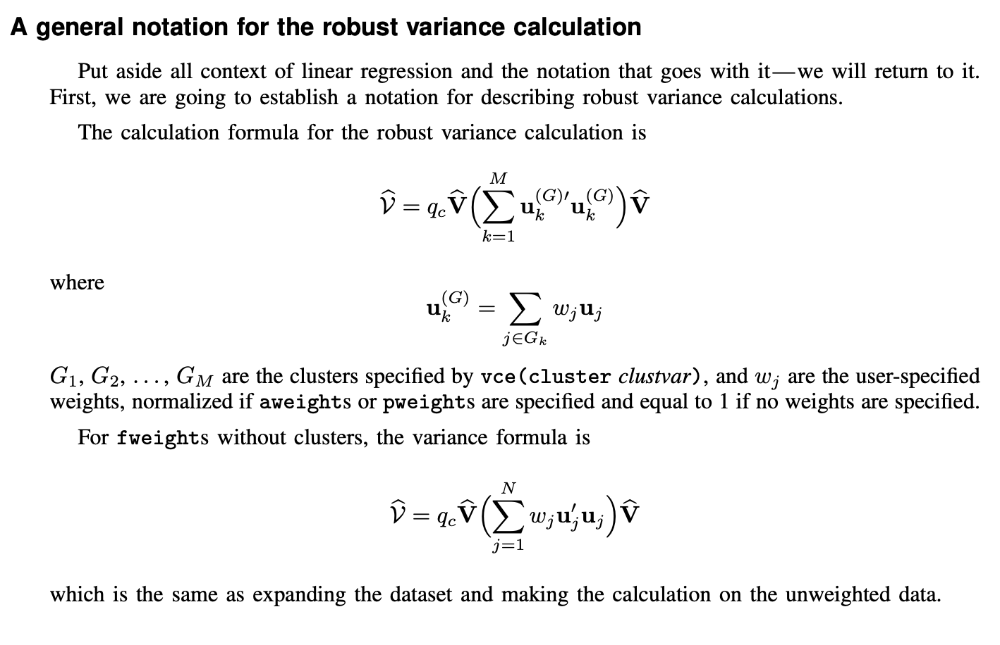
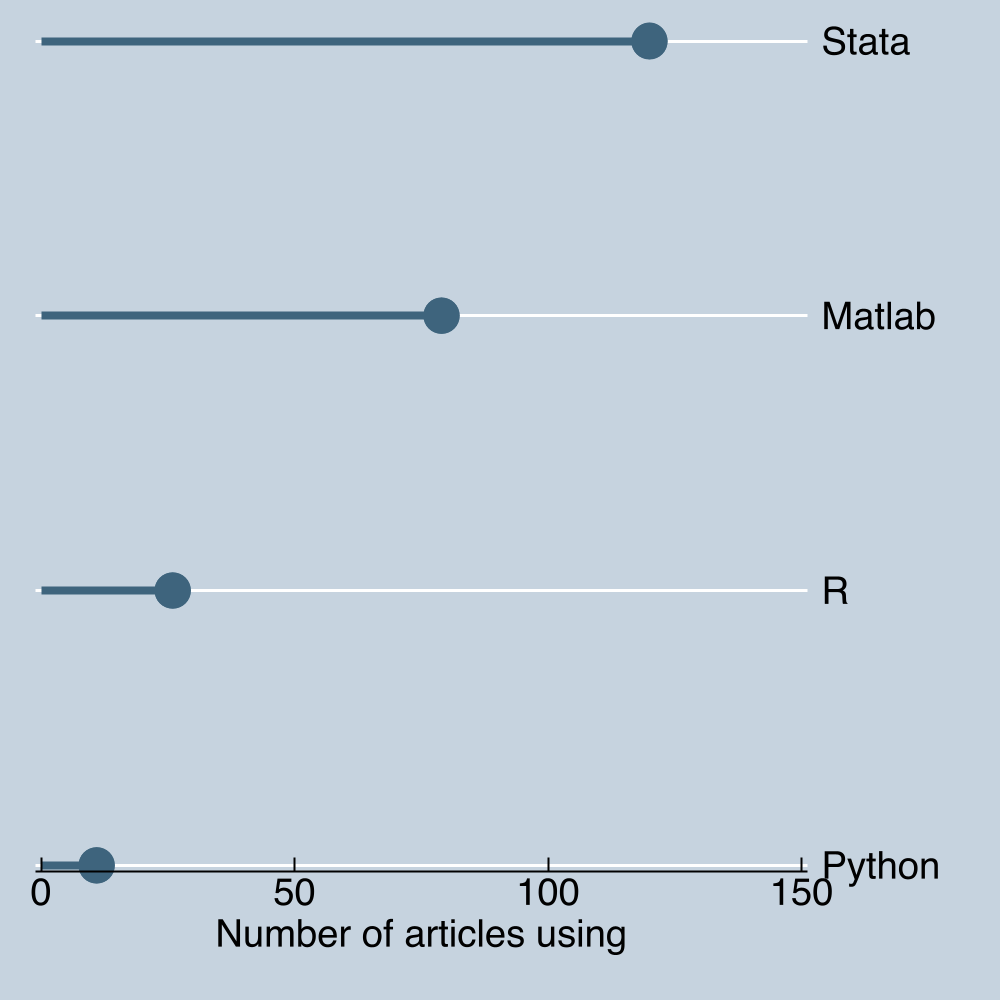
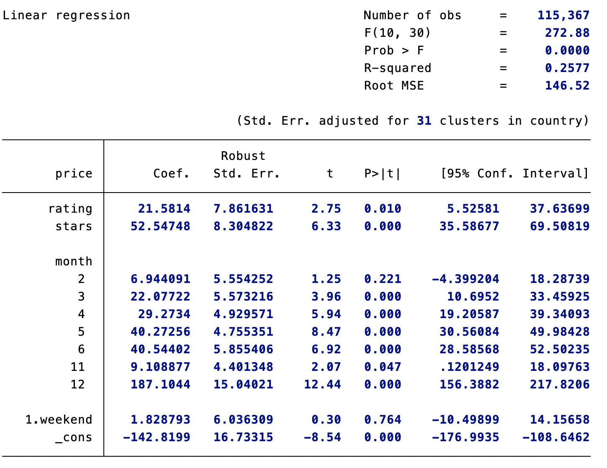
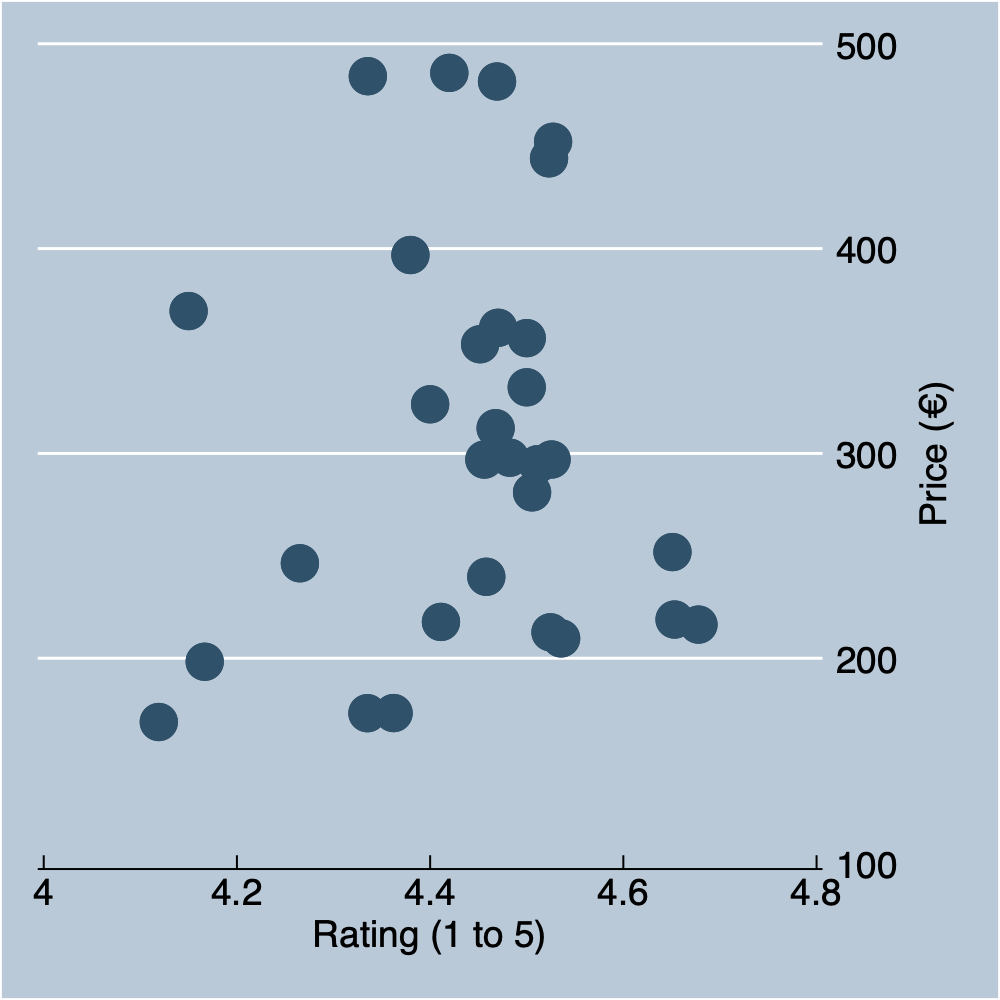
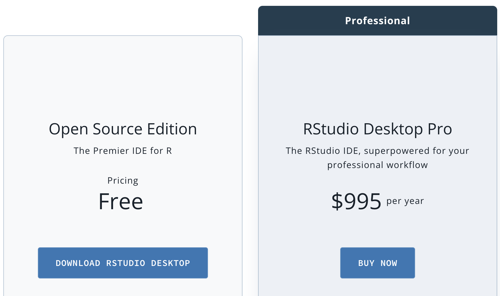
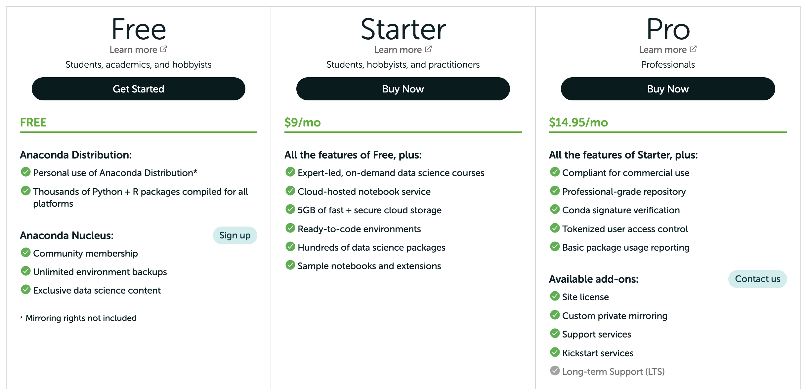

## What are we comparing?
:::columns
::::column
1. Programming language
2. Software application 
3. Documentation
4. Community
::::
::::column
::::
:::

## What are we comparing?
:::columns
::::column
1. \color{CTred}**Programming language**\color{black}
2. Software application 
3. Documentation
4. Community
::::
::::column
1. Designed for data
2. Designed for humans
3. Works right away
::::
:::

## What are we comparing?
:::columns
::::column
1. Programming language
2. \color{CTred}**Software application**\color{black} 
3. Documentation
4. Community
::::
::::column

::::
:::

## What are we comparing?
:::columns
::::column
1. Programming language
2. Software application 
3. \color{CTred}**Documentation**\color{black}
4. Community
::::
::::column

::::
:::

## What are we comparing?
:::columns
::::column
1. Programming language
2. Software application 
3. Documentation
4. \color{CTred}**Community**\color{black}
::::
::::column

::::
:::
\addtocounter{framenumber}{-1}

## What are we comparing?
:::columns
::::column
1. Programming language
2. Software application 
3. Documentation
4. \color{CTred}**Community**\color{black}
::::
::::column

::::
:::
\addtocounter{framenumber}{-1}

## What are we comparing?
:::columns
::::column
1. Programming language
2. Software application 
3. Documentation
4. \color{CTred}**Community**\color{black}
::::
::::column

::::
:::
\addtocounter{framenumber}{-1}

## What are we comparing?
:::columns
::::column
1. Programming language
2. Software application 
3. Documentation
4. \color{CTred}**Community**\color{black}
::::
::::column

::::
:::

## Data Wrangling and Regression
:::columns
::::column
\small
```stata
/* Hotel price data */
use "hotels-europe_price.dta", clear
/* Add hotel features (location, 
  stars, ratings, etc.) */
merge m:1 hotel_id using 
  "hotels-europe_features.dta"
/* Censor prices that are too high */
replace price = 1000 if price > 1000
/* Regress price on ratings, stars, 
  plus month, weekend dummies */
regress price rating stars i.month 
  i.weekend, vce(cluster country)
```
::::
\pause
::::column
{ width=100% }
::::
:::

## Data Wrangling and Visualization
:::columns
::::column
\small
```stata
/* keep only 5-star hotels */
keep if stars == 5
/* mean price and rating by country */
collapse (mean) price (mean) rating, 
  by(country)
label variable price "Price (€)"
label variable rating "Rating (1 to 5)"
scatter price rating, scheme(economist)
```
::::
\pause
::::column
\centering
{ width=80% }
::::
:::

## Much simpler than R
:::columns
::::column
\small
```stata
scatter price rating, scheme(economist)
```
::::
::::column
\small
```R
ggplot(five_star_data, 
  aes(x=mean_price, y=mean_rating)) +
  geom_point() +
  labs(x="Price (€)", 
    y="Rating (1 to 5)") +
  scale_color_economist()
```
::::
:::

## Stata vs Python
:::columns
::::column
\small
```stata
replace price = 1000 if price > 1000
```
::::
::::column
\small
```python
data.loc[data["price"] > 1000, 
  "price"] = 1000
```
::::
:::

# Burn
## Same in Python
\tiny
```python
import pandas as pd
import matplotlib.pyplot as plt

# load hotel price data
price_data = pd.read_stata("hotels-europe_price.dta")

# add hotel features (location, stars, ratings, etc.)
features = pd.read_stata("hotels-europe_features.dta")
data = price_data.merge(features, on="hotel_id", how="left")

# replace high prices with 1000
data.loc[data["price"] > 1000, "price"] = 1000

# regress price on ratings, stars, plus month, weekend dummies
data = pd.get_dummies(data, columns=["month", "weekend"])
result = sm.OLS(data["price"], data[["rating", "stars"] + list(data.columns[data.columns.str.startswith("month_")]) 
  + list(data.columns[data.columns.str.startswith("weekend_")])]).fit(cov_type="cluster", cov_kwds={"groups": data["country"]})

# keep only 5-star hotels
data = data[data["stars"] == 5]

# calculate mean price and rating by country
data = data.groupby("country").mean()[["price", "rating"]]

# label variables
data.rename(columns={"price": "Price (€)", "rating": "Rating (1 to 5)"}, inplace=True)

# scatterplot
data.plot(x="Price (€)", y="Rating (1 to 5)", kind="scatter", colormap="tab10", figsize=(8, 6))
plt.show()
```

## Same in R
\tiny
```r
library(tidyverse)
library(ggplot2)

# load hotel price data
price_data <- read_dta("hotels-europe_price.dta")

# add hotel features (location, stars, ratings, etc.)
features <- read_dta("hotels-europe_features.dta")
data <- left_join(price_data, features, by="hotel_id")

# replace high prices with 1000
data <- data %>% mutate(price=if_else(price > 1000, 1000, price))

# regress price on ratings, stars, plus month, weekend dummies
data <- data %>% mutate(month=factor(month), weekend=factor(weekend)) %>% nest(-country)
result <- data %>% mutate(model=map(data, ~ lm(price ~ rating + stars + month + weekend, data=.)),
                         summ=map(model, broom::tidy)) %>%
                unnest(summ)

# subset data for 5-star hotels only
five_star_data <- data %>% filter(stars == 5) %>%
                        group_by(country) %>%
                        summarize(mean_price=mean(price), mean_rating=mean(rating))

# create scatterplot
ggplot(five_star_data, aes(x=mean_price, y=mean_rating)) +
  geom_point() +
  labs(x="Price (€)", y="Rating (1 to 5)") +
  scale_color_economist()
```

## RStudio pricing
{ width=100% }

## Anaconda pricing
{ width=100% }